# Privacy-Preserving Browser Agent Architecture

Day 1 Task 1 freezes the overall architecture and end-to-end data flow for the five-day prototype. This document preserves the project's core idea: the browser agent must reason from sanitized, minimum-necessary webpage information instead of unnecessarily exposing raw sensitive data to the Agent.

## Core Data Flow

```mermaid
flowchart LR
  U[User Task] --> M3A[Member 3: Orchestration]
  M3A --> M1A[Browser/Webpage Understanding]
  M1A --> M1[Member 1: Browser Perception]
  M1 --> RPS[Raw PageState]
  RPS --> M2[Member 2: Privacy Engine]
  M2 --> SPS[SanitizedPageState]
  SPS --> M3B[Member 3: Agent/Reasoning]
  M3B --> AP[ActionPlan]
  AP --> VAL[Action Validation/Policy]
  VAL --> M1B[Member 1: Browser Execution]
  M1B --> AR[ActionResult]
  AR --> M3A
```



Text form:

```text
User Task
-> Browser/Webpage Understanding
-> Member 1: Browser Perception
-> Raw PageState
-> Member 2: Privacy Engine
-> SanitizedPageState
-> Member 3: Agent/Reasoning
-> ActionPlan
-> Action Validation/Policy
-> Member 1: Browser Execution
-> ActionResult
-> Agent continues or finishes
```

## End-To-End Flow

1. The user provides a task in natural language.
2. Member 3 receives the task and orchestrates the next browser observation.
3. Member 1 inspects the current page using DOM, accessibility tree, and lightweight visual/page representation.
4. Member 1 emits a raw `PageState` with temporary element IDs and actionable page structure.
5. Member 2 receives the raw `PageState`, detects sensitive/PII content and sensitive contexts, and sanitizes the page state.
6. Member 2 emits `SanitizedPageState`, preserving minimum necessary page structure while replacing sensitive values with placeholders.
7. Member 3 reasons only from the user task, sanitized state, and prior sanitized/action history.
8. Member 3 creates an `ActionPlan`.
9. Member 3 validates the action against policy and safety constraints before execution.
10. Member 1 executes only the validated browser action and revalidates the target element before acting.
11. Member 1 returns an `ActionResult`.
12. Member 3 either finishes the task or loops back for another page observation.

## Module Responsibilities

### Member 1: Browser Perception And Execution

Member 1 owns browser state capture and browser actions.

- Build raw page representation from DOM, accessibility tree, and lightweight visual/page context.
- Assign temporary element IDs for actionable elements.
- Track and revalidate elements before execution.
- Execute only validated actions from the frozen initial set: click, type, scroll, select, press key, and wait.
- Return action results and observed browser changes.
- Avoid making privacy decisions or agent reasoning decisions.

### Member 2: Privacy Engine

Member 2 owns local privacy analysis and sanitization.

- Detect sensitive/PII values in raw `PageState`.
- Detect sensitive contexts, including password fields, account settings, payment pages, personal profile fields, and private messages.
- Redact or replace sensitive values with stable placeholders.
- Maintain local placeholder-to-raw mappings when needed for the prototype.
- Verify that `SanitizedPageState` does not expose raw sensitive values unnecessarily.
- Avoid planning browser actions or executing browser actions.

### Member 3: Agent, Reasoning, And System Lead

Member 3 owns orchestration, reasoning, policy validation, and integration.

- Understand the user task and decide when a fresh page observation is needed.
- Construct safe, minimum-necessary context from `SanitizedPageState`.
- Produce action plans using sanitized page information.
- Validate planned actions before browser execution.
- Coordinate the perceive, sanitize, reason, validate, execute, observe loop.
- Stop when the task is complete or when safe progress is no longer possible.

## Trust And Privacy Boundaries

### Boundary 1: Webpage To Member 1

Webpage content is untrusted input. Member 1 may observe it to build page state, but it must not treat page text, scripts, labels, or instructions as trusted system instructions.

### Boundary 2: Member 1 To Member 2

Raw `PageState` may contain PII, secrets, account data, private messages, payment details, or other sensitive content. It flows only from Member 1 to Member 2.

### Boundary 3: Member 2 To Member 3

Only `SanitizedPageState` crosses into Agent reasoning. Sensitive raw values are redacted or replaced with placeholders such as `[EMAIL_1]`, `[PHONE_1]`, `[PASSWORD_FIELD]`, or `[PAYMENT_CARD_1]`.

### Boundary 4: Member 3 To Member 1

Member 3 sends only validated actions to Member 1 for execution. Member 1 performs final element revalidation before acting and returns `ActionResult`.

## Frozen Common Contracts

The exact lightweight boundary contracts are frozen in `docs/contracts.md` and the JSON Schemas under `contracts/`. Producers and consumers must validate the matching schema before a payload crosses a module boundary. The schemas are authoritative for field names, types, limits, and the initial action set; this architecture document remains authoritative for ownership and trust boundaries.

### `UserTask`

Producer: user interface or caller.

Consumer: Member 3.

Minimum fields:

- `task_id`: unique task identifier.
- `natural_language_goal`: user-provided task.
- `constraints`: optional task constraints or user preferences.

### `PageState`

Producer: Member 1.

Consumer: Member 2 only.

Minimum fields:

- `url`: current page URL.
- `title`: page title.
- `timestamp`: capture time.
- `elements`: actionable and relevant page elements.
- `visible_text`: visible page text needed for understanding.
- `accessibility_snapshot`: optional accessibility tree summary.
- `visual_summary`: optional lightweight visual/page representation.

Each element should include:

- `element_id`: temporary ID assigned by Member 1.
- `role` or `type`: accessible role, DOM type, or control type.
- `label`: label, accessible name, or nearby descriptive text.
- `text`: visible text when needed.
- `value`: current value when needed.
- `visible`: whether the element is visible.
- `enabled`: whether the element can be interacted with.
- `bounds`: optional bounding box or approximate position.

### `SanitizedPageState`

Producer: Member 2.

Consumer: Member 3.

Minimum fields:

- Same task-relevant structure as `PageState`.
- Sensitive raw values replaced with placeholders.
- Redaction metadata sufficient for Member 3 to understand that data exists without exposing the raw value.
- Actionable element IDs preserved when safe so Member 3 can target actions.

### `ActionPlan`

Producer: Member 3.

Consumer: Member 3 action validation/policy, then the browser layer only after validation.

The frozen shape is `contracts/action-plan.schema.json`: a plan has an `intent` and one to five structured actions. The initial action types are exactly `CLICK`, `TYPE`, `SCROLL`, `SELECT`, `PRESS_KEY`, and `WAIT`. Each type has a schema-defined payload; arbitrary JavaScript, selectors, unrestricted commands, and unsupported action types are invalid.

### `ValidatedAction`

Producer: Member 3 action validation/policy.

Consumer: Member 1.

Minimum fields:

- Approved action subset from `ActionPlan`.
- `validation_decision`: approved or rejected.
- `validation_reason`: short reason for the decision.
- `requires_revalidation`: whether Member 1 must confirm the element still matches before execution.

### `ActionResult`

Producer: Member 1.

Consumer: Member 3.

The frozen shape is `contracts/action-result.schema.json`. Its status enum distinguishes success, stale elements, invalid actions, execution failures, policy blocks, observation requirements, and timeouts. Failure statuses carry the shared sanitized error representation.

## Evaluation Metric Alignment

The architecture is intentionally lightweight but shaped by the prototype evaluation metrics.

1. Visual context accuracy, 25%
   - Member 1 preserves actionable structure, accessibility roles, labels, visibility, and optional bounding boxes or visual summaries.
   - Member 2 must preserve non-sensitive structural context so redaction does not make the page unusable for reasoning.

2. Sensitive/PII detection precision and recall, 20%
   - Member 2 is the single owner for sensitive value and sensitive-context detection.
   - Keeping detection isolated makes precision and recall measurable without mixing concerns across modules.

3. Redaction precision, 20%
   - Redaction happens before Agent reasoning.
   - Placeholders preserve useful task context while limiting sensitive data exposure.

4. Client-side resource utilization, 20%
   - Day 1 architecture avoids heavy local models, persistent raw page archives, advanced dynamic-DOM tracking, and unnecessary full-page processing.
   - Optional fields allow the prototype to include visual context only when needed.

5. End-to-end task latency, 15%
   - The loop is linear and minimal: observe, sanitize, reason, validate, execute, observe.
   - Member interfaces pass compact state rather than broad browser dumps.

## Assumptions And Open Decisions

Assumptions:

- The current workspace starts without existing implementation or architecture files.
- `docs/architecture.md` is the canonical Day 1 architecture document.
- Interfaces are language-neutral until the implementation stack is chosen.
- Raw sensitive values remain local and do not enter Agent reasoning.
- Placeholder mappings are local to Member 2 for the five-day prototype.
- Advanced prompt-injection defenses, sophisticated dynamic-DOM handling, model routing, and optimization are out of scope for this task.

Open decisions:

- Exact implementation language and framework.
- Exact sensitive/PII detector implementation.
- Whether placeholder mappings are purely in memory or stored temporarily for debugging during the prototype.
- The initial action set is frozen by `contracts/action-plan.schema.json`; later action types require a new contract revision.
- Exact shape of visual/page representation used by Member 1.

## Day 1 Scope Guardrails

This task establishes architecture and interfaces only. It does not implement later-day features such as:

- Sophisticated reasoning.
- Advanced prompt-injection defenses.
- Dynamic-DOM recovery beyond basic element revalidation.
- Advanced performance optimization.
- Full browser automation runtime.
- Production persistence, logging, or telemetry.

